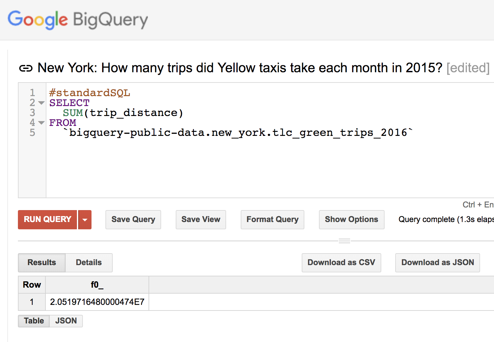
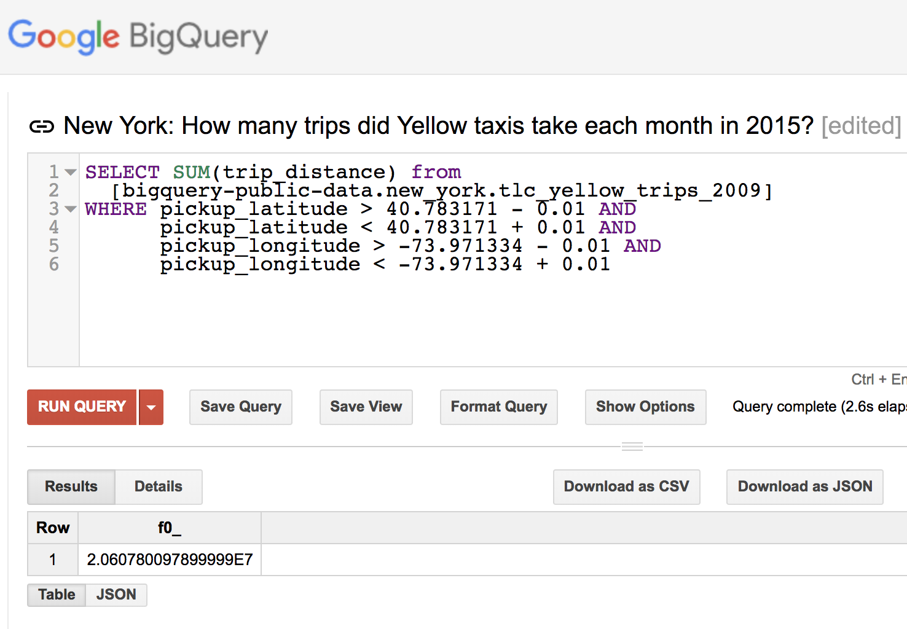

```{r setup, include=FALSE}
knitr::opts_chunk$set(echo = TRUE)
```

##NYC Taxi Trip Lengths Analysis

Introduction:
In the final project, I will do the NYC Taxi Trip Lengths Analysis.
My goals:

1. Plot the time series for yellow taxi trip lengthes from Jan.2009 to Dec.2015 by month, and analyze the plot to see the trending of taxi usage from 2009 to 2015.

2. Plot the trip length changes of yellow and green taxi by year, and do the test to compare the variance of yellow taxi and green taxi. Using the plot and test to see if different colors of Taxi got different influence by year from 2009 to 2015.

3. Plot the trip length changes of yellow taxi in Airports and Manhattan. Find out if differnt areas got differernt trip lengths and different influence.

Because dataset http://www.nyc.gov/html/tlc/html/about/trip_record_data.shtml has over 100G,  it is impratical to download all the CSV files. Thus, I use google big query https://cloud.google.com/bigquery/public-data/nyc-tlc-trips to compute the total trip length. 

Total trip length in bigquery.

The following sql used to compute the total trip length of green Taxi. 
```
SELECT
  SUM(trip_distance)
FROM
  `bigquery-public-data.new_york.tlc_green_trips_2016`
```


Trip length around location.
The following sql used to compute the total trip length of yellow Taxi picked up around Manhattan.
```
SELECT SUM(trip_distance) from
  [bigquery-public-data.new_york.tlc_yellow_trips_2009]
WHERE pickup_latitude > 40.783171 - 0.01 AND
      pickup_latitude < 40.783171 + 0.01 AND
      pickup_longitude > -73.971334 - 0.01 AND
      pickup_longitude < -73.971334 + 0.01
```



```{r}
library(ggplot2)
library(reshape2)
data = read.csv("trip_length.csv")
```

### Plot the time series for yellow taxi trip lengthes from Jan.2009 to Dec.2015 by month
```{r}
datayellow=read.csv("09-15.csv")
ts.plot(ts(datayellow[,-1], start = c(2009,1), frequency = 12), gpars = list(xlab = "Year", ylab = "Trip Length", lty=1))
```

###plot the time series for green taxi trip lengthes from Jan.2009 to Dec.2015 by month
```{r}
datagreen=read.csv("green13-15.csv")
ts.plot(ts(datagreen[,-1], start = c(2013,1), frequency = 12), gpars = list(xlab = " ", ylab = " ", lty=1))
```

According to the yellow taxi plot,trip lengths increased dramaticly in the beginning of 2010 and the middle of 2013, I guess its because the weather of these two periods are too cold or too hot, so people used Taxi more, or there were some events in these two periods. 
Also, people used taxi more in 2015 compared to the previous years. 
For the green taxi plot, because we do not have the data before 08/01/2013, I use zero to replace the triplength. According to the green xi plot, we can see that there is no dramatic peak for green taxi, which is different from the yellow taxi. 

### Plot the trip length changes of yellow and green taxi by year
```{r}
yellowData = data[data['color'] == 'yellow', ]
```

```{r}
#plot(yellowData["year"], yellowData["trip_length"])
#plot(yellowData$year, yellowData$trip_length, type="l")

ggplot(data=yellowData, aes(x=year, y=trip_length, group=1)) +
  geom_line()+
  geom_point() + 
  labs(title="Plot of Yellow Trip Length",x="Year", y = "Trip Length")
```

```{r}
greenData = data[data['color'] == 'green', ]
#plot(greenData$year, greenData$trip_length, type="l")

ggplot(data=greenData, aes(x=year, y=trip_length, group=1)) +
  geom_line()+
  geom_point() + 
  labs(title="Plot of Green Trip Length",x="Year", y = "Trip Length")
```

According to the plots for yellow taxi and green taxi, we can tell that the yellow taxi trip lengths are generally increased, but ups and downs frequently, ex. yellow taxi trip lengths decreased from 2013 to 2014, increased from 2014 to 2015, and then decreased from 2015 to 2016; the green taxi trip length incresed from 2013 to 2015 and decresed from 2015 to 2016. So, the trending of the yellow taxi is different from the green taxi. 

### Do the F-test and t test to find whether different taxi have different trending
```{r}
var.test(greenData$trip_length, yellowData$trip_length)
```
```{r}
t.test(greenData$trip_length, yellowData$trip_length)
```

For F test, since the p-value = 0.001949654 , which is smaller than 0.05, we reject the hypothesis that the variances of yellow trip length and green trip length are equal. 
For T test, since the p-value = 0.00319 , which is smaller than 0.05, we reject the hypothesis that the trip lengths of yellow taxi and green taxi are equal. 
So, according to the plot the the test results, the different color of taxi got different influence by the time and got different trendings.

### Plot the trip length changes of yellow taxi in Airports and Manhattan 
```{r}
trip_area = read.csv("trip_area.csv")

trip_area$Airports = 1000 * trip_area$Airports
trip_area_melt <- melt(trip_area, id="Year") 

ggplot(data=trip_area_melt,
       aes(x=Year, y=value, colour=variable)) +
       geom_line() + geom_point() +
  labs(title="Plot of Yellow Trip Length of different areas",x="Year", y = "Trip Length")

```

According to the plot, the trip lengths of Yellow taxi has different trending in Manhattan and Airport from 2009 to 2015. The Airport trip lengths dicreased from 2010, but the trip lengths of Manhattan generally incresed from 2010 to 2015, especially from 2014 to 2015. However, the trip lengths of Manhattan decresed dramaticlly from the beginning of 2015. 

###Do t-test to see if the manhattan trip lengths and the airport trip lengths are different
```{r}
t.test(trip_area$Manhattan,trip_area$Airports)
```

Since the p-value =0.1156 , which is bigger than 0.05, failed to reject the hypothesis that Manhattan and Airport trip lengths are equal. So, different areas got different trip lengths for yellow taxi.


